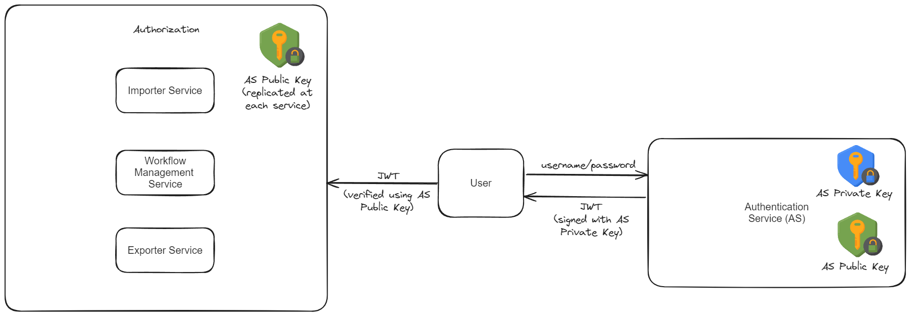

## Use Case: Manual File Input and Export to Excel Spreadsheet

1. **Setup Schemas and Templates:**
   - The user interacts with the workflow management service to configure schemas and templates for document processing.

2. **Document Processing:**
   - When the user needs a document processed, it is submitted to the importer service.

3. **Processing and Storage:**
   - The importer service dispatches the document to the Document Information Extraction API for processing.
   - Continuously monitoring, the importer service polls the API until processing is finalized.
   - Upon completion, the processed document is securely stored in the Document Database.

4. **Export to Excel Spreadsheet:**
   - To retrieve the processed document's information, the user initiates an export request.
   - The frontend triggers a request to the exporter service for exporting the data.
   - The exporter service retrieves the pertinent information from the Document Database.
   - Organizing the data, the exporter service formats it into an Excel spreadsheet (xlsx).

## Authentication and Authorization
1. **User Authentication:**
   - Upon login, the user sends their credentials (username and password) to the Authentication Service.
   - The Authentication Service utilizes its private key to sign and generate a JSON Web Token (JWT) containing user information.

2. **Token Usage:**
   - Subsequent requests from the frontend include this JWT in the request header as a means of authentication.

3. **Token Validation:**
   - Upon receiving a request, the receiving service employs the Authentication Service's public key to validate the JWT.
   - Upon successful validation, the service retrieves user information embedded within the JWT.

4. **Authorization:**
   - With the user information extracted from the JWT, the receiving service can enforce authorization policies as per the user's permissions and roles.

