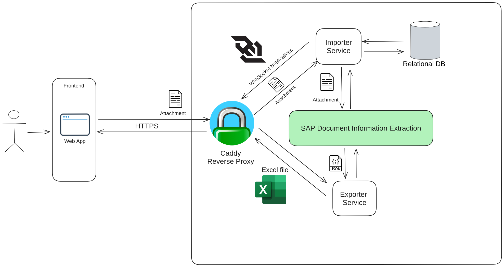
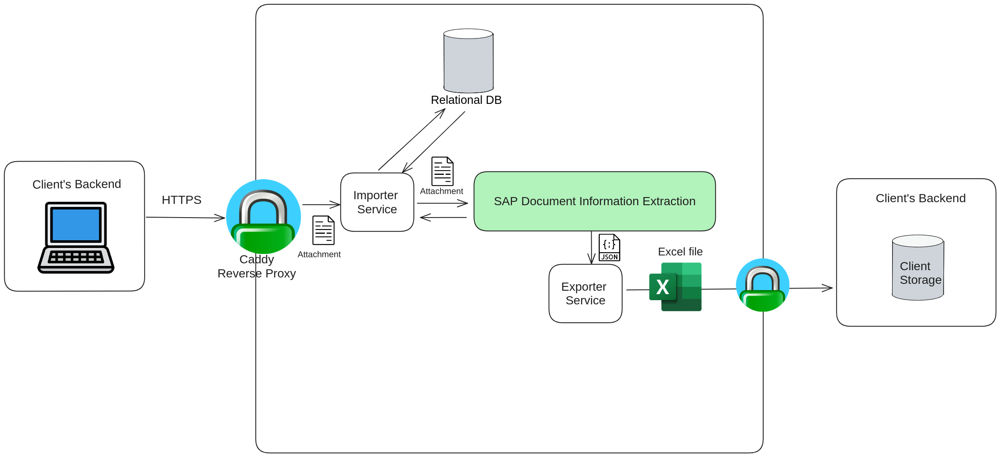

# Architecture Overview

Our product is built using the microservices architectural pattern, comprising the following services:

- **Authentication Service:** Handles user authentication.
- **Workflow Management Service:** Manages the configuration of schemas, templates, workflows, and ground truths for information extracted from documents.
- **Import Service:** Receives files from users in various ways (e.g., email, manual input) and forwards them to the DOX API for processing.
- **Exporter Service:** Formats the extracted information according to the user's needs, such as generating Excel files or JSON data structures.

To simplify the interaction with multiple services and efficiently route client requests, we use Caddy as a reverse proxy. This setup abstracts the complexity of our microservices architecture and ensures seamless request forwarding to the appropriate service.

## Authentication and Authorization
1. **User Authentication:**
   - Upon login, the user sends their credentials (username and password) to the Authentication Service.
   - The Authentication Service utilizes its private key to sign and generate a JSON Web Token (JWT) containing user information.

2. **Token Usage:**
   - Subsequent requests from the frontend include this JWT in the request header as a means of authentication.

3. **Token Validation:**
   - Upon receiving a request, the receiving service employs the Authentication Service's public key to validate the JWT.
   - Upon successful validation, the service retrieves user information embedded within the JWT.

4. **Authorization:**
   - With the user information extracted from the JWT, the receiving service can enforce authorization policies as per the user's permissions and roles.

## Use Case: Workflow Configuration

### Schema Configuration
A schema defines the fields a user wants to extract from the files sent to a workflow. To configure a schema, an initial request is made to create it in the DOX API, and the resulting schema DOX ID is stored in a relational database. Subsequent requests can edit the schema by modifying header fields and line items. These requests use the schema DOX ID from the database to update the schema in the DOX API.

Predefined schemas are available to all users upon account creation.

### Template Configuration
A template specifies where each field of a schema is located within a document template (i.e., the common structure for files sent to a given workflow). To configure a template, an initial request is made to create it in the DOX API, associating it with a specific schema (whose DOX ID is retrieved from the relational database). The resulting template DOX ID is then stored in the database.

### Workflow Configuration
A workflow is associated with a template. When a user sends a file for processing, the template DOX ID is retrieved from the database, along with the schema DOX ID associated with the template. Both IDs are sent with the file to the DOX API for processing.

### Document Ground Truth
Document extraction can sometimes be incorrect. Users can add or remove header fields or line items and edit the extracted values. They can also use our UI to adjust the bounding box coordinates for each field. A request with the correct extraction is sent to our API and forwarded to the DOX API. We store the file DOX ID in the database, which is used to send the correct values to the DOX API. This process helps train the template, improving the accuracy of future extractions.

## Use Case: Manual File Input and Export to Excel Spreadsheet

1. **Document Submission:**
   - Users submit a document to the importer service for processing.

2. **Processing and Storage:**
   - The importer service sends the document to the Document Information Extraction (DOX) API for processing.
   - The importer service continuously polls the DOX API to monitor the status of the document processing.
   - Once processing is complete, the importer service stores the document's DOX ID in a relational database.
   - The confidence level for each extracted field is evaluated. If any field's confidence falls below the configured minimum threshold, the processing is marked as a failure.
   - Upon successful processing, the importer service sends a notification to the frontend via a websocket, informing the user that the document has been successfully processed.

3. **Export to Excel Spreadsheet:**
   - To export the processed document's information, users initiate an export request via the frontend.
   - The frontend sends a request to the exporter service.
   - The exporter service retrieves the DOX ID from the relational database.
   - Using the DOX ID, the exporter service requests the processed information from the DOX API.
   - The exporter service formats the DOX API response into an Excel spreadsheet (xlsx) and sends the spreadsheet back to the user.

## Use Case: File Input via Client's Backend and Export via Client's Backend

This is very similar to the previous scenario, except all the requests are explicitly made by the client's backend instead of being implicitly made by the browser.

## Use Case: Email File Input and Export to Excel Spreadsheet

**Pre-requisites**
- The user must have already configured a workflow and the associated email.

1. **Document Submission:**
   - The user sends an email to doclarifai's email address from the email associated with the workflow. To enable the system to identify the target workflow, the destination email must be in the format `doclarifai+id@gmail.com`.
   - The importer service polls the Gmail API and processes unread emails.
   - The importer service parses the email sender's information and associates the attached file with the corresponding workflow, verifying that the sender has the necessary permissions to send files for this workflow.
   - The importer service then reads the email attachments and prepares them for processing.

2. **Processing and Storage:**
   - Same as [Manual File Input and Export to Excel Spreadsheet](#use-case-manual-file-input-and-export-to-excel-spreadsheet).

3. **Export to Excel Spreadsheet:**
   - Same as [Manual File Input and Export to Excel Spreadsheet](#use-case-manual-file-input-and-export-to-excel-spreadsheet).

