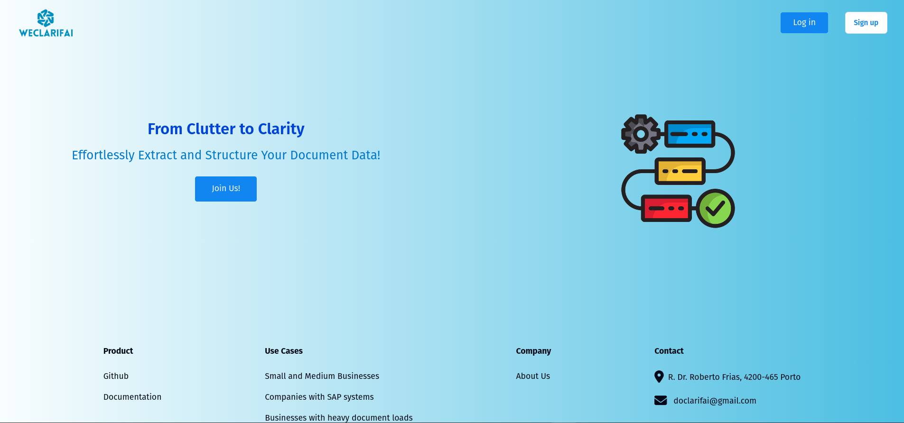
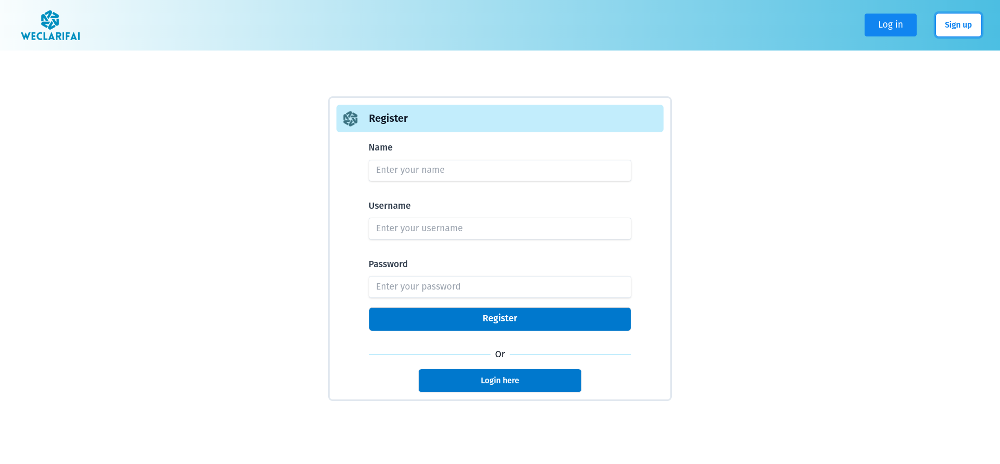
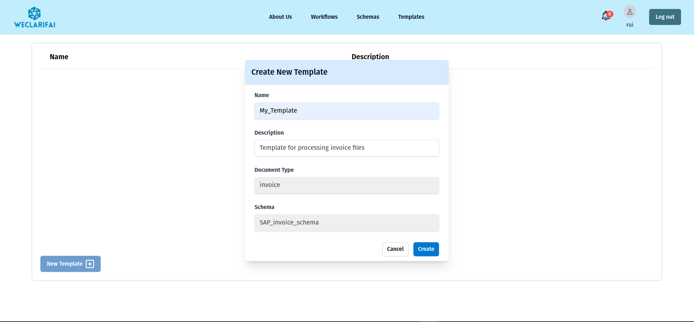
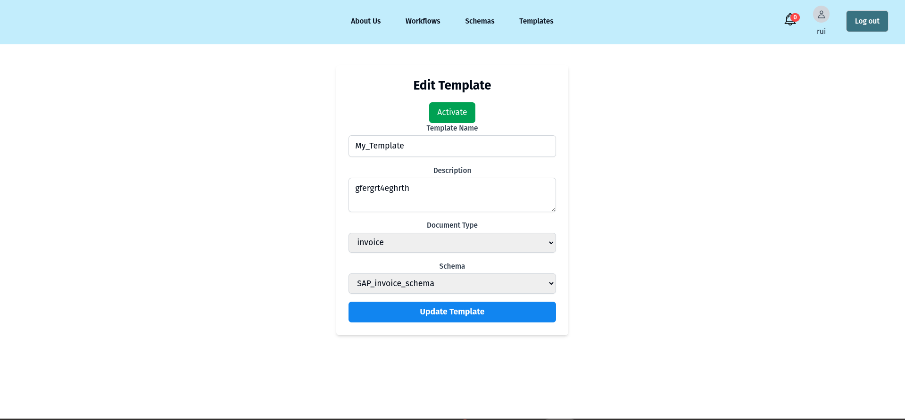
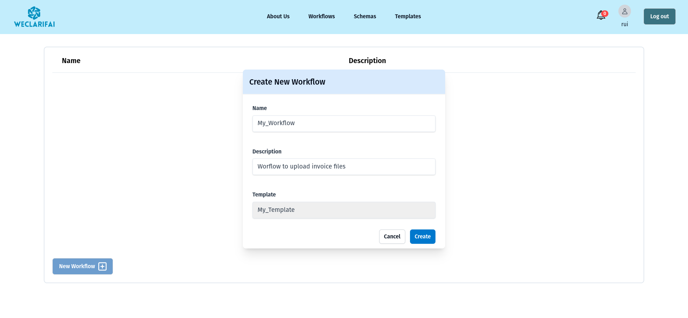
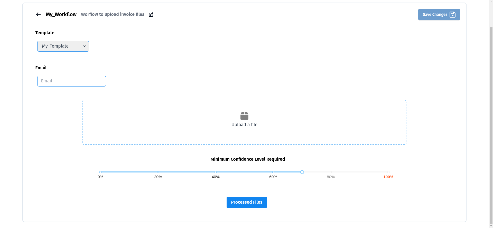
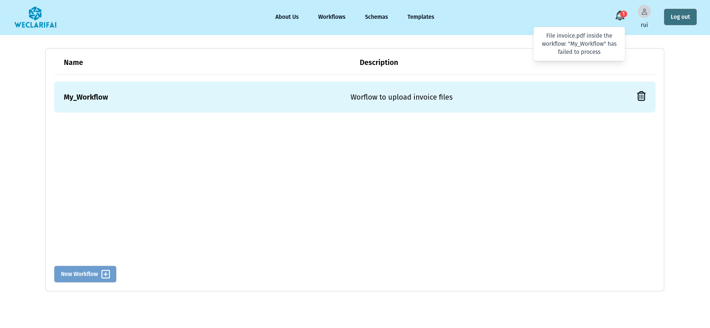
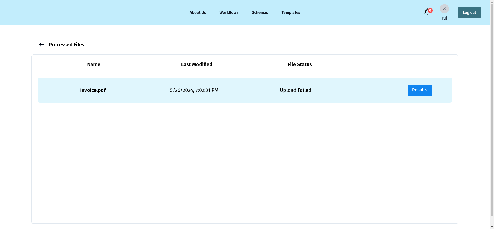

# User Manual for DoclarifAI

## Introduction

Welcome to DoclarifAI! This platform allows authenticated users to create workflows for document processing, automate tasks via email, and customize schemas for AI model training to extract desired information from documents. This manual will guide you through the key features and functionalities of DoclarifAI.

## 1. Getting Started

To get started with DoclarifAI, follow these steps:

1. **Sign Up**: Visit our website and sign up for an account.

2. **Log In**: Use your credentials to log in to the platform.

3. **Dashboard**: Upon logging in, you'll be directed to the dashboard where you can manage your workflows, documents, schemas, and more.

## 2. Creating Templates

Before creating workflows, you need to set up templates and schemas:

1. To create a **Template**, navigate to the **Templates** section and click on **Create New Template**.
2. We can use a default schema for now since SAP provides various schemas for different document types.
3. After that make sure to activate the template, otherwise, it won't be available for use in workflows.

## 3. Creating Workflows

Workflows are the core of DoclarifAI's document processing capabilities. To create a workflow:

1. Navigate to the **Workflows** section.
2. Click on **Create New Workflow**.
3. Fill in the necessary details, such as the workflow name, description and template.
4. Click **Save** to create the workflow.

## 4. Submitting Documents

To submit documents for processing within a workflow:

1. Go to the **Workflows** section and select your workflow.
2. Click on upload file.
3. Upload the document you want to process.
4. The document will be queued for processing.

## 5. Receiving Notifications

Once a document is successfully processed, you will receive a notification in the frontend. Notifications will appear in the notification area of your dashboard.

## 6. Viewing Processed Files

To view the processed files:

1. Navigate to the **Workflows** section.
2. Select the workflow that contains your processed document.
3. Click on **Processed Files** to view the list of documents and their extracted information.

## 7. Exporting Files

You can export the processed files to Excel:

1. In the **Processed Files** section of your workflow, select the files you wish to export.
2. Click on **Export to Excel**.
3. The files will be downloaded as an Excel spreadsheet.

## 8. Automating Tasks via Email

Automate document submission via email by forwarding attachments to our designated email address:

1. Send an email with the document attached to `doclarifai+<workflow_id>@gmail.com`.
   - Replace `<workflow_id>` with the ID of your workflow.
2. The document will be automatically added to the specified workflow for processing.

## 9. Creating Custom Schemas

Custom schemas allow you to train the AI model to better extract specific fields:

1. Navigate to the **Schemas** section.
2. Click on **Create New Schema**.
3. Define the fields you want the AI to extract.
4. Save the schema.

## 10. Activating Schemas and Templates

After creating a schema:

1. **Activate the Schema**: Go to the **Schemas** section and activate the schema you created.
2. **Add to Template**: Create a new template and add your activated schema to it.
3. **Activate the Template**: Navigate to the **Templates** section and activate the template.
4. **Associate with Workflow**: Link the activated template to your desired workflow.

## 11. Setting Confidence Values

You can set a confidence threshold to determine the accuracy of the document processing:

1. In your workflow settings, set the confidence value (e.g., 50%).
2. Documents with a confidence interval below this value will be flagged for manual review.

## 12. Manual Configuration

If a document fails to meet the confidence threshold, you can manually configure the extracted values:

1. In the **Processed Files** section, locate the document flagged for manual review.
2. Click on **Results**.
3. Adjust the extracted values as needed and save the changes.

